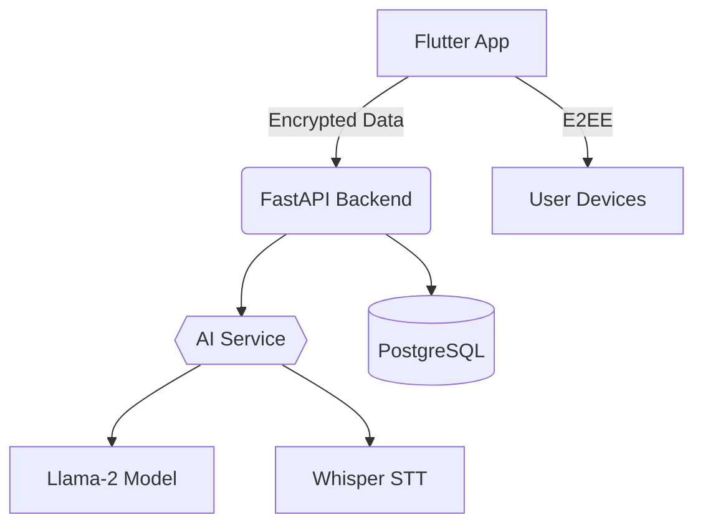

# TRUST ME
# 🤖 **Your AI Personal Assistant** 🌟

[](https://flutter.dev)
[](https://opensource.org/licenses/MIT)
[](https://github.com/yourusername/ai-assistant/pulls)

**An open-source, privacy-first AI assistant that proactively solves problems using ambient intelligence.**  
*"Your thoughts become actions, seamlessly."*

---

## 🎥 Demo  
https://github.com/yourusername/ai-assistant/assets/123456789/demo-video.mp4  
*(Replace with your demo GIF/video)*

---

## ✨ **Features**  
- 🌍 **Multilingual Mastery**: Understands 10+ languages (Spanish, Hindi, Arabic, etc.) with Whisper.cpp.
- 🔒 **Military-Grade Encryption**: End-to-end encrypted conversations & local data storage.
- 📡 **Ambient Intelligence**: Background monitoring of sound, location, and device sensors.
- 💡 **Proactive Recommendations**: NLP-driven suggestions (e.g., "Schedule a break?").
- 🤖 **Auto-Drafting**: Generates message drafts using Llama-2/GPT-4 and seeks user approval.
- 📱 **Cross-Platform**: iOS, Android, and web support via Flutter.

---

## 🛠️ **Tech Stack**  
| Component              | Technology                          |
|------------------------|-------------------------------------|
| **Frontend**           | Flutter 3.13, Riverpod State Management |
| **Backend**            | Python FastAPI, PostgreSQL, Redis   |
| **AI/ML**              | Hugging Face Transformers, Llama-2 |
| **Encryption**         | AES-256-GCM, AWS KMS                |
| **Database**           | Supabase (PostgreSQL + Realtime)    |
| **DevOps**             | Docker, GitHub Actions, AWS ECS     |

---

## 🚀 **Getting Started**

### **Prerequisites**
- Flutter 3.13+
- Python 3.10+
- PostgreSQL 14+
- [Whisper.cpp](https://github.com/ggerganov/whisper.cpp) setup

### **Installation**
```bash
# Clone repo
git clone https://github.com/yourusername/ai-assistant.git
cd ai-assistant

# Install Flutter dependencies
flutter pub get

# Set up Python backend
cd backend && pip install -r requirements.txt

# Configure environment variables
cp .env.example .env
# Add your API keys (OpenAI, AWS KMS, etc.)
```

### **Run Locally**
```bash
# Start backend
python -m uvicorn app.main:app --reload

# Launch Flutter app
flutter run -d chrome
```

---

## 🌐 **Architecture**


---

## 📝 **Usage Examples**

### **1. Generate a Message Draft**
```dart
// User mentions needing to message Jim
final draft = await AIService.generateDraft(
  context: "Project delay update",
  recipient: "Jim"
);
// Shows approval dialog
showDraftApproval(draft); 
```

### **2. Proactive Notification**
```python
# backend/services/recommendation_engine.py
def detect_stress(user_id):
    audio_data = get_ambient_audio(user_id)
    if stress_detected(audio_data):
        send_notification(
            user_id, 
            "Take a 5-minute meditation break? 🧘",
            priority="high"
        )
```

---

## 🤝 **Contributing**  
We 💖 contributors! Please read our:
- [Contribution Guidelines](CONTRIBUTING.md)
- [Code of Conduct](CODE_OF_CONDUCT.md)

**First-time friendly issues:**  
- [ ] Add support for Swahili language  
- [ ] Implement battery optimization  
- [ ] Create dark mode UI  

---

## 📜 **License**  
This project is licensed under the MIT License - see [LICENSE](LICENSE).

---

## 🙏 **Acknowledgments**  
- Whisper.cpp by OpenAI for multilingual STT  
- Mozilla Common Voice Dataset  
- Hugging Face Transformers library  

---

**Made with ❤️ by [Kushvith](https://kushvith.great-site.net)**  
*Let's build the future of ethical AI together!*  
``` 

Replace placeholders (yourusername, demo assets, etc.) with your project details. For maximum impact:
1. Add screenshots in `/assets/readme/`
2. Include real API examples
3. Link to your live demo
4. Add contributor hall of fame
